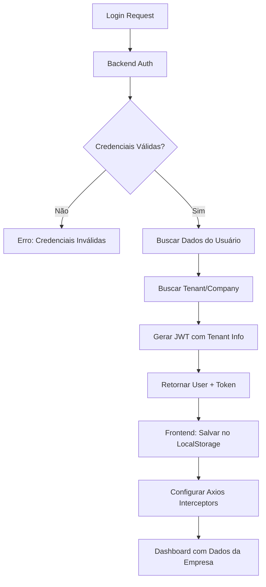
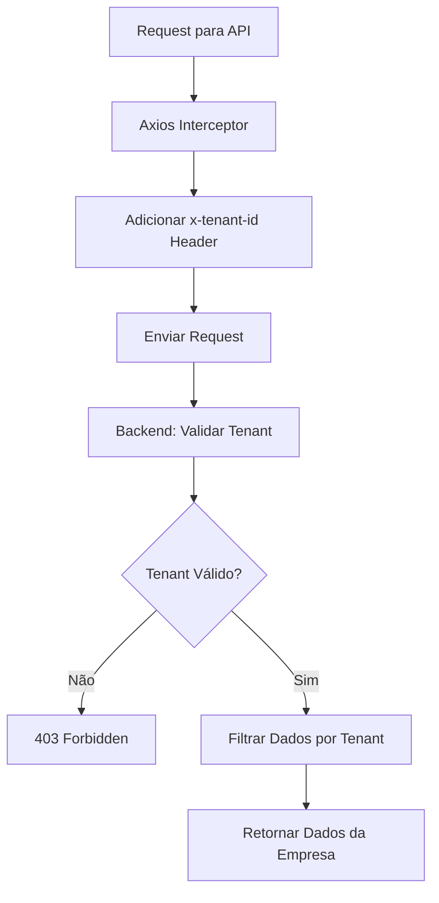

# SEND-10 — Autenticação Segura de Usuário da Empresa Cliente

| Campo | Valor |
| -- | -- |
| Status | Released (completed) |
| Prioridade | No priority |
| Responsável | — |
| Time | Sendspeed |
| Projeto | SendSpeed 2.0 |
| Labels | User Story |
| Parent | — |
| Criada | 2025-05-26T20:31:44.162Z por pedro.antunes@sendspeed.com |
| Iniciada | — |
| Concluída | 2025-07-10T12:19:45.446Z |
| Arquivada | — |
| Vencimento | — |
| Branch | hugofernandes/send-10-autenticacao-segura-de-usuario-da-empresa-cliente |
| URL | https://linear.app/sendspeed/issue/SEND-10/autenticacao-segura-de-usuario-da-empresa-cliente |

## Descrição

> **Como** um usuário administrador da empresa cliente,
>
> **Quero** poder realizar login na plataforma utilizando minhas credenciais (email e senha),
>
> **Para que** eu possa acessar as funcionalidades de visualização de dados de rastreamento e análise de comportamento exclusivos da minha empresa.

---

### **👉 Critérios de Aceite:**

* Deve existir uma tela de login.
* O usuário deve conseguir se autenticar com credenciais válidas.
* Após o login, o usuário deve ser direcionado para um dashboard inicial da sua empresa.
* Deve haver tratamento para credenciais inválidas.
* O sistema deve garantir que o usuário só acesse dados da sua própria empresa (multitenant).
* Usar .envs diferentes (/configs/env/production|development|local)

---

### 📊 Estado Atual da Implementação

### ✅ **Funcionalidades Já Implementadas:**

#### 1\. **Sistema de Login Completo**

* ✅ Tela de login com design moderno (`LoginPage.tsx`)
* ✅ Validação de campos (email/senha obrigatórios)
* ✅ Estados de loading e erro
* ✅ Toggle para mostrar/ocultar senha
* ✅ Redirecionamento automático se já logado

#### 2\. **Context de Autenticação**

* ✅ AuthContext com TypeScript completo
* ✅ Persistência no localStorage
* ✅ Funções login/logout
* ✅ Estado de loading
* ✅ Interface User bem definida

#### 3\. **Proteção de Rotas**

* ✅ ProtectedRoute component
* ✅ Redirecionamento para login se não autenticado
* ✅ Loading state durante verificação
* ✅ Todas as rotas principais protegidas

#### 4\. **API de Autenticação**

* ✅ Endpoints login/logout/me configurados
* ✅ Axios instance com interceptors
* ✅ Tratamento de erros estruturado
* ✅ TypeScript interfaces completas

#### 5\. **UI/UX Avançada**

* ✅ Header com dropdown do usuário
* ✅ Informações completas (nome, email, empresa, role)
* ✅ Logout funcional
* ✅ Design responsivo (mobile/desktop)

#### 6\. **Configuração Multi-Ambiente**

* ✅ Configuração por ambiente (.env files)
* ✅ Detecção automática de ambiente
* ✅ URLs diferentes por ambiente
* ✅ Build scripts separados

---

## 🔍 **Análise da História do Usuário**

### **Critérios de Aceite - Status:**

| Critério | Status | Implementação |
| -- | -- | -- |
| ✅ Tela de login | **COMPLETO** | `LoginPage.tsx` - design profissional |
| ✅ Autenticação com credenciais | **COMPLETO** | API + validation + error handling |
| ✅ Dashboard pós-login | **COMPLETO** | Redirecionamento para `/` (Index) |
| ✅ Tratamento credenciais inválidas | **COMPLETO** | Mensagens de erro específicas |
| ❌ **Sistema multitenant** | **PENDENTE** | **LACUNA PRINCIPAL** |
| ✅ Configuração por ambiente | **COMPLETO** | .env files + auto-detection |

---

## ❌ **Lacunas Identificadas**

### 1\. **Sistema Multitenant (CRÍTICO)**

**O que falta:**

* Isolamento de dados por empresa/tenant
* Validação de acesso aos dados da empresa
* Middleware de verificação de tenant
* Estrutura de dados com tenant_id

**Impacto:** Usuários podem acessar dados de outras empresas

### 2\. **Estrutura de Dados**

**Current User Interface:**

```typescript
interface User {
  id: string;
  name: string;
  email: string;
  company: string;      // Apenas string, não ID
  role: string;
  avatar?: string;
}
```

**Needed for Multitenant:**

```typescript
interface User {
  id: string;
  name: string;
  email: string;
  company: string;
  companyId: string;    // 🔴 FALTANDO - ID único da empresa
  tenantId: string;     // 🔴 FALTANDO - ID do tenant
  role: string;
  permissions: string[]; // 🔴 FALTANDO - Permissões específicas
  avatar?: string;
}
```

### 3\. **Validação de Acesso aos Dados**

**APIs que precisam de validação de tenant:**

* `/api/visitors` - deve filtrar por tenant
* `/api/visitors/events` - deve filtrar por tenant
* `/api/segments` - deve filtrar por tenant
* `/api/campaigns` - deve filtrar por tenant

### 4\. **Middleware de Autenticação**

**O que falta:**

```typescript
// Interceptor para adicionar tenant em todas as requests
axios.interceptors.request.use((config) => {
  const user = getCurrentUser();
  if (user?.tenantId) {
    config.headers['x-tenant-id'] = user.tenantId;
  }
  return config;
});
```

---

## 🔧 **Implementações Necessárias**

### 1\. **Atualizar Interface User**

```typescript
// src/contexts/AuthContext.tsx
interface User {
  id: string;
  name: string;
  email: string;
  company: string;
  companyId: string;     // ✅ ADICIONAR
  tenantId: string;      // ✅ ADICIONAR  
  role: string;
  permissions: string[]; // ✅ ADICIONAR
  avatar?: string;
}
```

### 2\. **Middleware de Tenant**

```typescript
// src/lib/tenantMiddleware.ts
export const addTenantToRequests = () => {
  axios.interceptors.request.use((config) => {
    const user = JSON.parse(localStorage.getItem('user') || '{}');
    
    if (user?.tenantId) {
      config.headers['x-tenant-id'] = user.tenantId;
      config.headers['x-company-id'] = user.companyId;
    }
    
    return config;
  });
};
```

### 3\. **Validação de Acesso aos Dados**

```typescript
// src/lib/dataAccess.ts
export const validateTenantAccess = (data: any) => {
  const user = getCurrentUser();
  
  if (!user?.tenantId) {
    throw new Error('Usuário não autenticado');
  }
  
  // Verificar se os dados pertencem ao tenant do usuário
  if (data.tenantId && data.tenantId !== user.tenantId) {
    throw new Error('Acesso negado - dados de outra empresa');
  }
  
  return true;
};
```

### 4\. **Atualizar APIs para Multitenant**

```typescript
// src/lib/visitorsApi.ts  
getVisitors: async (params?: {
  page?: number;
  limit?: number;
  searchTerm?: string;
  // Remover tenantId dos parâmetros - será enviado no header
}): Promise<ApiResponse<{ visitors: Visitor[]; pagination: Pagination }>>
```

### 5\. **Configuração por Ambiente para Multitenant**

```env
# .env.development
VITE_ENVIRONMENT=development
VITE_BACKEND_URL=https://sendspeed-api-dev.fly.dev
VITE_TENANT_VALIDATION=enabled
VITE_DEBUG_MODE=true

# .env.production  
VITE_ENVIRONMENT=production
VITE_BACKEND_URL=https://sendspeed-api-prod.fly.dev
VITE_TENANT_VALIDATION=strict
VITE_DEBUG_MODE=false
```

---

## 🏗️ **Arquitetura Multitenant Proposta**

### **Fluxo de Autenticação:**



### **Fluxo de Requisições de Dados:**



---

## 🎯 **Implementação Sugerida**

### **Fase 1: Estrutura Base Multitenant**

1. ✅ Atualizar interface User com tenantId/companyId
2. ✅ Implementar middleware de tenant no Axios
3. ✅ Atualizar AuthContext para lidar com tenant
4. ✅ Adicionar validação de tenant nas APIs

### **Fase 2: Validação de Dados**

1. ✅ Implementar validateTenantAccess function
2. ✅ Atualizar todas as APIs para validar tenant
3. ✅ Adicionar error handling para acesso negado
4. ✅ Implementar logging de tentativas de acesso

### **Fase 3: Configuração por Ambiente**

1. ✅ Adicionar variáveis de tenant nos .env files
2. ✅ Configurar validação por ambiente (dev/prod)
3. ✅ Implementar debug mode para desenvolvimento
4. ✅ Adicionar health checks para tenant

---

## 🚨 **Aspectos de Segurança**

### **1. Validação de Token JWT**

```typescript
// Validar se o token contém tenant info
const validateJWTTenant = (token: string) => {
  const decoded = jwt.decode(token);
  if (!decoded.tenantId || !decoded.companyId) {
    throw new Error('Token inválido - informações de tenant ausentes');
  }
};
```

### **2. Sanitização de Dados**

```typescript
// Sempre filtrar dados por tenant antes de retornar
const filterByTenant = (data: any[], tenantId: string) => {
  return data.filter(item => item.tenantId === tenantId);
};
```

### **3. Auditoria de Acesso**

```typescript
// Log de tentativas de acesso a dados
const logDataAccess = (userId: string, tenantId: string, resource: string) => {
  console.log(`User ${userId} from tenant ${tenantId} accessed ${resource}`);
};
```

---

## 📊 **Estrutura de Dados Multitenant**

### **Users Table:**

```sql
CREATE TABLE users (
  id UUID PRIMARY KEY,
  email VARCHAR UNIQUE NOT NULL,
  password_hash VARCHAR NOT NULL,
  name VARCHAR NOT NULL,
  company_id UUID NOT NULL REFERENCES companies(id),
  tenant_id UUID NOT NULL REFERENCES tenants(id),
  role VARCHAR NOT NULL DEFAULT 'user',
  permissions JSONB DEFAULT '[]',
  created_at TIMESTAMP DEFAULT NOW(),
  updated_at TIMESTAMP DEFAULT NOW()
);
```

### **Companies/Tenants Table:**

```sql
CREATE TABLE companies (
  id UUID PRIMARY KEY,
  tenant_id UUID UNIQUE NOT NULL,
  name VARCHAR NOT NULL,
  domain VARCHAR,
  settings JSONB DEFAULT '{}',
  created_at TIMESTAMP DEFAULT NOW()
);
```

### **Data Tables com Tenant:**

```sql
-- Exemplo: Visitors com tenant
CREATE TABLE visitors (
  id UUID PRIMARY KEY,
  tenant_id UUID NOT NULL REFERENCES companies(tenant_id),
  user_id VARCHAR,
  email VARCHAR,
  -- outros campos...
  created_at TIMESTAMP DEFAULT NOW()
);

-- Index para performance
CREATE INDEX idx_visitors_tenant_id ON visitors(tenant_id);
```

---

## ✅ **Critérios de Aceite Atualizados**

### **🔐 Sistema de Login**

```gherkin
Cenário: Login com credenciais válidas
  Dado que tenho credenciais válidas
  Quando faço login
  Então devo ser autenticado
  E redirecionado para o dashboard
  E ver apenas dados da minha empresa
```

### **🏢 Isolamento Multitenant**

```gherkin
Cenário: Acesso a dados da empresa
  Dado que estou logado na empresa A
  Quando acesso qualquer funcionalidade
  Então devo ver apenas dados da empresa A
  E não devo ter acesso a dados da empresa B
```

### **🌍 Configuração por Ambiente**

```gherkin
Cenário: Configuração automática por ambiente
  Dado que estou no ambiente development
  Quando a aplicação carrega
  Então deve conectar ao backend de development
  E usar configurações de debug habilitadas
```

---

## 📈 **Métricas de Sucesso**

### **Funcionalidade**

* ✅ Login funciona com credenciais válidas
* ✅ Isolamento total de dados por tenant
* ✅ Configuração automática por ambiente
* ✅ Error handling para acesso negado

### **Segurança**

* ✅ Validação de tenant em todas as APIs
* ✅ JWT contém informações de tenant
* ✅ Logs de auditoria implementados
* ✅ Sanitização de dados por tenant

### **Performance**

* ✅ Queries otimizadas com tenant filtering
* ✅ Indexes apropriados para tenant
* ✅ Cache respeitando isolamento
* ✅ Loading states otimizados

---

## Histórico de status

- Backlog (backlog): 2025-05-26T20:31:44.162Z → 2025-05-27T04:35:56.189Z
- To-do (unstarted): 2025-05-27T04:35:56.189Z → 2025-05-28T10:19:24.512Z
- Backlog (backlog): 2025-05-28T10:19:24.512Z → 2025-05-28T13:56:39.594Z
- To-do (unstarted): 2025-05-28T13:56:39.594Z → 2025-07-10T12:19:45.099Z
- Released (completed): 2025-07-10T12:19:45.099Z → atual

## Relações

- relatedTo: SEND-18 — Análise de Comportamento via IA com Importação de Padrões

## Anexos

—
