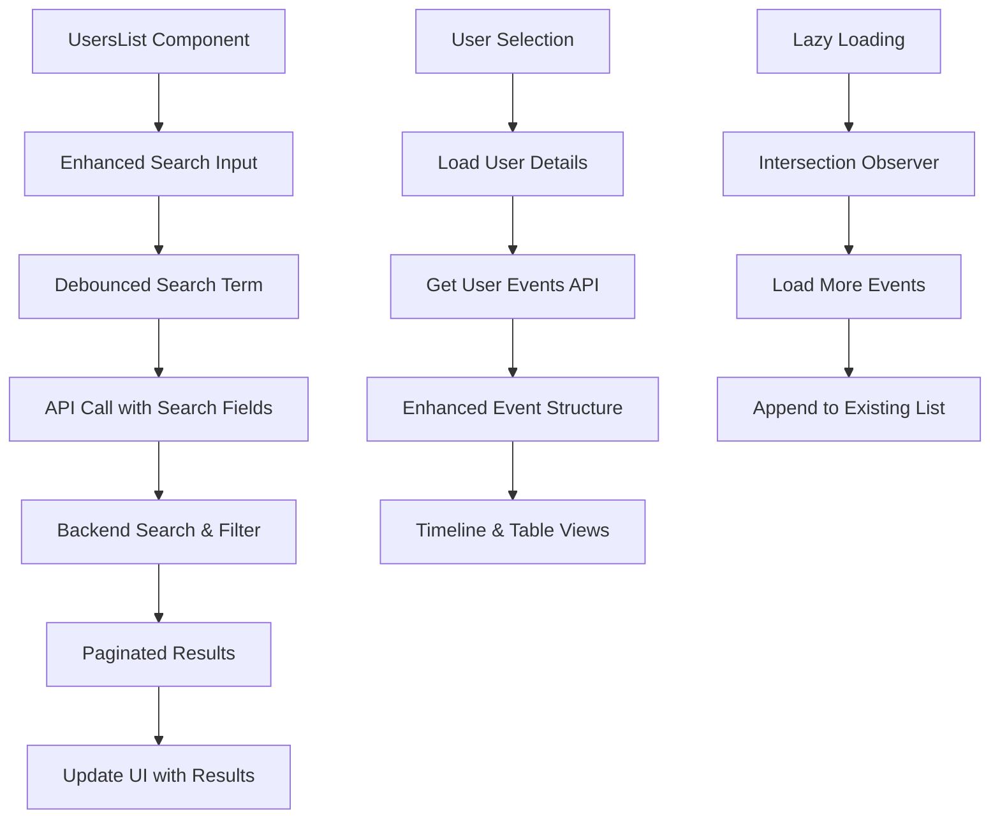

# SEND-16 — Visualização Detalhada da Jornada do Usuário no Painel de Logs de Atividade com Paginação e Busca Avançada

| Campo | Valor |
| -- | -- |
| Status | Released (completed) |
| Prioridade | No priority |
| Responsável | Hugo Fernandes |
| Time | Sendspeed |
| Projeto | SendSpeed 2.0 |
| Labels | User Story |
| Parent | — |
| Criada | 2025-05-26T21:40:03.508Z por pedro.antunes@sendspeed.com |
| Iniciada | 2025-06-04T11:09:55.011Z |
| Concluída | 2025-06-10T18:37:01.829Z |
| Arquivada | — |
| Vencimento | 2025-06-16 |
| Branch | hugofernandes/send-16-visualizacao-detalhada-da-jornada-do-usuario-no-painel-de |
| URL | https://linear.app/sendspeed/issue/SEND-16/visualizacao-detalhada-da-jornada-do-usuario-no-painel-de |

## Descrição

**Como** analista de marketing, produto ou atendimento,
**Quero** clicar em um usuário (identificado ou anônimo) na tela de "Logs de Atividade"
**Para que** eu possa visualizar todos os eventos registrados desse usuário, organizados por timeline, tabela e (se for identificado) com seus dados de contato, de forma eficiente e navegável.

### 📌 Funcionalidade Esperada

1. Na **tela de lista de usuários ("Logs de Atividade")**, deve ser possível:
   * Buscar usuários por:
     * Nome (caso identificado)
     * `externalId`
     * `userId`
     * `localId`
     * `sessionId`
     * Nome de usuario e email se identificado 
   * O campo de busca deve ser **textual, único** e permitir buscas parciais e exatas.
   * Os resultados devem aparecer imediatamente após a digitação (search-as-you-type)  dbounce (2 segs) ou após confirmar.
   * Lazyload 
   * Paginado
2. A lista deve exibir:
   * Nome ou rótulo "Usuário Anônimo"
   * Email (se identificado)
   * Total de eventos
   * Última atividade
   * LocalId(nome) / UserId(identificado)
3. Ao clicar em um usuário, abrir a visualização detalhada com as seguintes abas:
   * **Timeline**: sequência dos eventos com ícones, título da ação, URL, data/hora, dispositivo, localização.
   * **Tabela**: todos os eventos brutos listados com filtros por tipo, url, timestamp.
   * **Análise**: espaço reservado para análises manuais e futuras análises de IA.
   * **Contatos**: se o usuário estiver identificado, mostrar e-mail, telefone, endereço e redes sociais coletadas via `traits`.

---

### ✅ Critérios de Aceite (Atualizados)

#### 🔎 Busca na Lista de Usuários

* A busca deve aceitar os seguintes campos: `nome`, `externalId`, `userId`, `localId`, `sessionId`.
* A filtragem pode ser feita no frontend com debounce ou delegada ao backend (preferencial).
* Deve ser insensível a maiúsculas/minúsculas (case insensitive).

#### 📄 Carregamento de Eventos

* Os eventos devem ser **paginados pelo backend** com parâmetros:
  * `page`, `limit` (ex: 20 por página)
  * `sort = desc` (ordenado por `timestamp` decrescente — eventos mais recentes primeiro)
* Cada aba (Timeline, Tabela) deve carregar os eventos da mesma fonte de dados paginada.

#### 🧩 Estrutura esperada da resposta de eventos:

```
json
```

CopiarEditar

`{ "identity": { "type": "identified", "userId": "user_abc123", "externalId": "crm_001" }, "pagination": { "page": 1, "limit": 20, "total": 86 }, "events": [ { "eventId": "evt_001", "timestamp": "2025-05-26T13:55:00Z", "eventType": "pageview", "sessionId": "sess_123", "localId": "device_abc", "url": "/produto/iphone", "device": "mobile", "location": "São Paulo, BR" }, ... ] }`

#### 🗃️ Contatos do Usuário (se identificado)

* Os dados enviados via `UserInsight.identify()` devem ser exibidos na aba "Contatos":
  * Email principal
  * Telefones
  * Endereços
  * Redes sociais
* Deve indicar data/hora da última atualização desses dados.

---

### 🔧 Requisitos Técnicos

* A API de eventos deve permitir paginação por `userId`, `externalId`, `localId` ou `sessionId`, e ordenação por timestamp.
* A interface deve chamar a API de forma incremental (scroll infinito ou paginação clássica).
* As abas devem compartilhar o mesmo dataset base para evitar múltiplas requisições duplicadas.

---

# Estado Atual da História

### 1\. **Estrutura de Dados de Visitantes** (`visitor.json`)

```json
{
  "success": true,
  "data": {
    "users": [
      {
        "type": "identified|anonymous",
        "userId": "string",
        "externalId": "string|null",
        "localId": "string", 
        "sessionId": "string",
        "name": "string|null",
        "email": "string|null"
      }
    ],
    "pagination": {
      "page": 1,
      "limit": 20,
      "total": 8
    }
  }
}
```

**✅ Campos Disponíveis para Busca:**

* `userId` ✅
* `externalId` ✅
* `localId` ✅
* `sessionId` ✅
* `name` ✅ (se identificado)
* `email` ✅ (se identificado)

### 2\. **Estrutura de Eventos** (`visitor-events.json`)

```json
{
  "success": true,
  "data": {
    "events": [
      {
        "id": "string",
        "eventType": "pageview|click|search|product_view|purchase|form_submit|form_interaction",
        "timestamp": "ISO_DATE",
        "url": "string",
        "device": {
          "type": "desktop|mobile|tablet",
          "userAgent": "string",
          "os": "string",
          "browser": "string"
        },
        "location": {
          "city": "string",
          "state": "string",
          "country": "string",
          "coordinates": {
            "latitude": "number",
            "longitude": "number"
          }
        },
        "metadata": {},
        "user": {
          "id": "string",
          "name": "string|null",
          "email": "string|null"
        }
      }
    ],
    "pagination": {
      "currentPage": 1,
      "totalPages": 3,
      "totalItems": 30,
      "hasMore": true
    }
  }
}
```

## 📋 Estado Atual da Implementação

### **✅ Funcionalidades Já Implementadas:**

1. **Lista de Usuários com Stats**
   * Total de visitantes
   * Usuários identificados/anônimos
   * Padrões comportamentais detectados
2. **Busca Básica**
   * Campo de busca por nome, email, sessionId, persona
   * Filtros por tipo (identificado/anônimo)
3. **Paginação Frontend**
   * 10 itens por página
   * Navegação entre páginas
4. **Visualização Detalhada**
   * Timeline de eventos
   * Tabela de eventos
   * Análise comportamental
   * Contatos (para identificados)

### **❌ Lacunas Identificadas:**

1. **Busca Limitada**
   * Não busca por `externalId`, `userId`, `localId`
   * Sem debounce implementado
   * Apenas busca frontend (sem server-side)
2. **Paginação**
   * Apenas frontend, não há lazy loading real
   * Não há paginação backend para usuários
3. **Estrutura de Response para Eventos de Usuário**
   * Não segue o formato esperado na história
4. **Filtros Avançados**
   * Sem filtros por data, tipo de evento, etc.

## 🔧 Implementações Necessárias

### 1\. **Atualizar Interface de Busca**

```typescript
interface EnhancedSearchParams {
  searchTerm?: string;
  fields?: Array<'name' | 'email' | 'externalId' | 'userId' | 'localId' | 'sessionId'>;
  type?: 'identified' | 'anonymous';
  page?: number;
  limit?: number;
}
```

### 2\. **Implementar Debounce para Busca**

```typescript
// Hook personalizado para debounce
const useDebounce = (value: string, delay: number) => {
  const [debouncedValue, setDebouncedValue] = useState(value);

  useEffect(() => {
    const handler = setTimeout(() => {
      setDebouncedValue(value);
    }, delay);

    return () => {
      clearTimeout(handler);
    };
  }, [value, delay]);

  return debouncedValue;
};
```

### 3\. **Atualizar API de Visitantes para Busca Avançada**

```typescript
// Atualizar visitorsApi.getVisitors
getVisitors: async (params?: {
  page?: number;
  limit?: number;
  searchTerm?: string;
  searchFields?: string[]; // ['name', 'email', 'externalId', 'userId', 'localId', 'sessionId']
  type?: 'identified' | 'anonymous';
}): Promise<ApiResponse<{ visitors: Visitor[]; pagination: Pagination }>>
```

### 4\. **Implementar Estrutura Esperada para Eventos de Usuário**

```typescript
interface UserEventsResponse {
  identity: {
    type: 'identified' | 'anonymous';
    userId: string;
    externalId?: string;
  };
  pagination: {
    page: number;
    limit: number;
    total: number;
  };
  events: Array<{
    eventId: string;
    timestamp: string;
    eventType: string;
    sessionId: string;
    localId: string;
    url: string;
    device: string;
    location: string;
  }>;
}
```

### 5\. **Adicionar Lazy Loading e Scroll Infinito**

```typescript
interface InfiniteScrollConfig {
  hasMore: boolean;
  isLoading: boolean;
  loadMore: () => void;
  threshold?: number; // pixels before end to trigger load
}
```

### 6\. **Expandir Lista para Mostrar Informações Requeridas**

```typescript
interface EnhancedUserListItem {
  // Existentes
  name: string;
  email: string;
  totalEvents: number;
  lastActivity: string;
  
  // Novos campos requeridos
  localId: string;     // Para anônimos
  userId: string;      // Para identificados  
  externalId?: string; // Para identificados
  lastEventTimestamp: string; // Última atividade real baseada em eventos
}
```

## 🎯 Melhorias na UX/UI

### 1\. **Campo de Busca Unificado**

* Placeholder: "Buscar por nome, email, ID externo, ID do usuário, ID local ou sessão..."
* Indicadores visuais de que campo está sendo pesquisado
* Sugestões de busca (autocomplete)

### 2\. **Indicadores de Carregamento**

* Skeleton loading para lista de usuários
* Loading states para busca
* Progress indicators para lazy loading

### 3\. **Filtros Visuais Melhorados**

* Chips removíveis para filtros ativos
* Contador de resultados em tempo real
* Botão "Limpar filtros"

### 4\. **Timeline e Tabela Otimizadas**

* Virtualização para grandes listas de eventos
* Filtros por tipo de evento
* Ordenação por timestamp, tipo, etc.
* Export de dados

## 📱 Responsividade e Performance

### 1\. **Otimizações Mobile**

* Lista compacta para mobile
* Busca com teclado otimizado
* Swipe gestures para navegação

### 2\. **Performance**

* Memoização de componentes pesados
* Virtual scrolling para listas grandes
* Caching de resultados de busca
* Throttling de requests de API

## 🔄 Fluxo de Dados Atualizado



## 🎯 Próximos Passos

### **Prioridade Alta:**

1. ✅ Implementar busca por todos os campos requeridos
2. ✅ Adicionar debounce à busca
3. ✅ Atualizar API para suportar busca server-side
4. ✅ Implementar lazy loading na lista

### **Prioridade Média:**

1. ✅ Melhorar estrutura de resposta de eventos
2. ✅ Adicionar filtros avançados na tabela de eventos
3. ✅ Implementar scroll infinito

### **Prioridade Baixa:**

1. ✅ Otimizações de performance (virtualização)
2. ✅ Export de dados
3. ✅ Sugestões de busca (autocomplete)

## 📊 Métricas de Sucesso

* **Performance:** Busca deve responder em < 300ms
* **UX:** Resultados devem aparecer em tempo real (debounce 300ms)
* **Funcionalidade:** Busca deve funcionar em todos os 6 campos especificados
* **Escalabilidade:** Lista deve suportar lazy loading para 10k+ usuários
* **Responsividade:** Interface deve funcionar bem em mobile e desktop

> **[Embed — arquivo]:** Arquivo anexado ao corpo da descrição (não é imagem): `user-story-updated.md` (markdown, 7282 bytes). Hospedado em uploads.linear.app (URL assinada, expira). Conteúdo não renderizável como imagem — trata-se de uma versão atualizada da user story em Markdown.

## Histórico de status

- Backlog (backlog): 2025-05-26T21:40:03.508Z → 2025-05-27T04:35:45.497Z
- To-do (unstarted): 2025-05-27T04:35:45.497Z → 2025-05-28T10:19:50.677Z
- Backlog (backlog): 2025-05-28T10:19:50.677Z → 2025-05-28T13:57:10.550Z
- To-do (unstarted): 2025-05-28T13:57:10.550Z → 2025-06-04T11:09:55.000Z
- In Progress (started): 2025-06-04T11:09:55.000Z → 2025-06-10T18:37:01.816Z
- Released (completed): 2025-06-10T18:37:01.816Z → atual

## Relações

—

## Anexos

—
