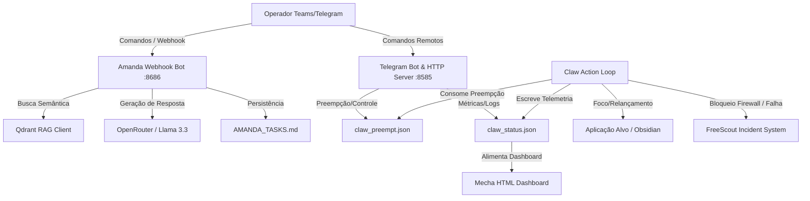

# ⚙️ MECHA System Daemon Integration

> **"Orquestração cognitiva, conformidade RAG-first e resiliência de hardware no Akasha Terminal."**

O **MECHA** é um ecossistema integrado que une o processamento cognitivo do hardware **Claw**, a orquestração multi-agente do **Tribunal Hermes** e o bot de conformidade **Amanda** (integrado via MS Teams webhook), reportando métricas em tempo real para o painel de telemetria **Mecha Huggs Workforce Studio (HWorkforceStudio)** e abrindo chamados de incidentes de segurança/resiliência no **FreeScout**.

---

## 🗺️ Visão Geral da Arquitetura

O ecossistema MECHA é composto por três pilares principais:
1. **Automação Cognitiva (Claw)**: Realiza ações baseadas em IA no sistema operacional, contendo um **Firewall Cognitivo** (Ollama + regras determinísticas) e rotinas de **Auto-Recuperação** de janelas em foco.
2. **Conformidade e RAG-first (Amanda Bot)**: Um bot baseado em FastAPI que recebe comandos via Webhook do MS Teams (como `/tribunal`, `/dev`, `/qa`, `/task`), consulta a base vetorial local do **Qdrant** e persiste as tarefas pendentes em `AMANDA_TASKS.md`.
3. **Telemetria e Controle de Preempção (Studio)**: O `telegram_bot.py` hospeda o servidor HTTP do Dashboard (`mecha.html`) na porta `8585`, recebe comandos remotos via bot de Telegram e gerencia o controle de preempção da automação.



---

## 📁 Estrutura do Workspace

```
.mecha/
├── AMANDA_TASKS.md                      # Stack viva de tarefas em conformidade
├── STUDIO_BACKEND_CONTRACT.md           # Contrato da API real HTTP/CORS
├── project_initialization.md            # Registro das diretrizes de governança
├── CORE/                                # Histórico de logs e base de conhecimento
├── squads/                              # Definições organizacionais do Tribunal
├── intelligence/
│   └── squads/                          # Definições JSON de agentes e workflows
└── ops/                                 # Scripts operacionais e recursos estáticos
    ├── .env                             # Arquivo de configuração de ambiente (Ignorado do git)
    ├── mecha.html                       # HTML do Dashboard de telemetria
    ├── mecha.ps1                        # CLI SDK PowerShell
    ├── build_mecha.ps1                  # Script de empacotamento com PyInstaller
    ├── logs/
    │   ├── claw_status.json             # Estado atual da automação
    │   └── amanda_tasks.json            # Tasks estruturadas em JSON
    └── patterns/                        # Componentes em Python
        ├── amanda_teams_bot.py          # FastAPI webhook do MS Teams
        ├── telegram_bot.py              # Telegram Bot e Servidor HTTP do Dashboard
        ├── test_e2e_tribunal.py         # Suite de testes Fim-a-Fim
        ├── dynamic_typing.py            # Validador estrutural e AST de planos
        ├── claw_loop.py                 # Loop de ações físicas do Claw
        ├── claw_control.py              # Firewall Cognitivo (Ollama / Regex)
        ├── claw_freescout.py            # Integração e abertura de incidentes
        ├── claw_vision.py               # Captura de tela e análise visual
        └── claw_ocr.py                  # OCR híbrido de tela
```

---

## 🚀 Como Inicializar o Sistema

### 1. Pré-requisitos
Certifique-se de ter o Python 3.10+ instalado e o gerenciador de pacotes configurado.
* **Ollama (Opcional p/ Firewall Judge)**: Instale e carregue o modelo:
  ```bash
  ollama pull llama3
  ollama serve
  ```
* **Qdrant**: Certifique-se de que a instância do Qdrant está rodando se deseja utilizar a busca semântica completa (ou mantenha o mock ativo).

### 2. Configurar o Ambiente
Crie ou edite o arquivo `ops/.env` com as seguintes credenciais:
```ini
TELEGRAM_BOT_TOKEN=seu_token_aqui
TELEGRAM_CHAT_ID=seu_chat_id_aqui
MECHAHUGGIES_BOT_TOKEN=token_alternativo_se_houver
MECHA_FORCE_MOCK_EMBEDDINGS=1

# === Teams Integration ===
TEAMS_PORT=8686
TEAMS_SHARED_SECRET=sua_assinatura_aqui  # (Deixe vazio em dev se usar MECHA_ALLOW_INSECURE=1)
MECHA_ALLOW_INSECURE=1                  # Permite requisições sem assinatura em desenvolvimento
OBSIDIAN_DIR=C:\Caminho\Para\Seu\Obsidian
OPENROUTER_API_KEY=sua_chave_openrouter
```

### 3. Rodar os Daemons de Segundo Plano

#### A. Inicializar o Bot do Telegram e Dashboard HTTP:
```powershell
python ops/patterns/telegram_bot.py
```
* O servidor HTTP do Dashboard subirá na porta `8585` (ou `8282`/`8181` em caso de conflito).
* Acesse o Dashboard em: `http://localhost:8585/mecha.html`.

#### B. Inicializar o Webhook do MS Teams (Amanda):
```powershell
python ops/patterns/amanda_teams_bot.py
```
* O servidor FastAPI subirá na porta `8686` ouvindo a rota `/webhook/teams`.

---

## ⚖️ Validação e Testes Integrados

Para certificar-se de que a estrutura e as APIs estão operantes, o MECHA provê ferramentas de validação automatizadas.

### Validação de Planos (Hierarquia AST e Metadados)
Para checar um plano de mudanças markdown antes de submetê-lo:
```powershell
python ops/patterns/dynamic_typing.py --validate project_initialization.md
```

### Executar Testes Fim-a-Fim (E2E)
Com o `telegram_bot.py` rodando, execute a suite de testes comportamentais do Tribunal:
```powershell
python ops/patterns/test_e2e_tribunal.py
```

---

## 🛠️ Comandos do CLI SDK (mecha.ps1)

O script `ops/mecha.ps1` expõe o SDK unificado do projeto. Habilite o profile importando `ops/profile.ps1` no terminal ou invoque os comandos diretamente:

* **Validação de markdown**:
  ```powershell
  ./ops/mecha.ps1 sdk check-plan project_initialization.md
  ```
* **Executar o Dashboard / Bot**:
  ```powershell
  ./ops/mecha.ps1 sdk run-bot
  ```
* **Executar a suite E2E**:
  ```powershell
  ./ops/mecha.ps1 sdk tribunal-test
  ```
* **Disparar o loop do Claw**:
  ```powershell
  ./ops/mecha.ps1 sdk run-claw "Obsidian" --goal "Inserir log diário de conformidade"
  ```
* **Renderização manual no ComfyUI**:
  ```powershell
  ./ops/mecha.ps1 sdk comfy-render ops/comfy_req_test.json
  ```

---

## 🛡️ Firewall & Incidências (FreeScout)

* **Detecção de Bloqueio**: Cliques em botões que exibam palavras como *"deletar"* ou *"excluir"* são bloqueados pelo Firewall determinístico. Se a consulta cognitiva ao Ollama classificar a ação como `dangerous` ou `destructive`, o Firewall também é acionado.
* **Abertura de Incidentes**: No momento do bloqueio ou de uma falha crítica de recuperação, o `claw_loop.py` dispara um registro para o FreeScout na URL `FREESCOUT_URL` definida no `.env`.
* **Link no Painel**: O Dashboard exibe um chip de alerta interativo com o link direto para o chamado do FreeScout correspondente.
