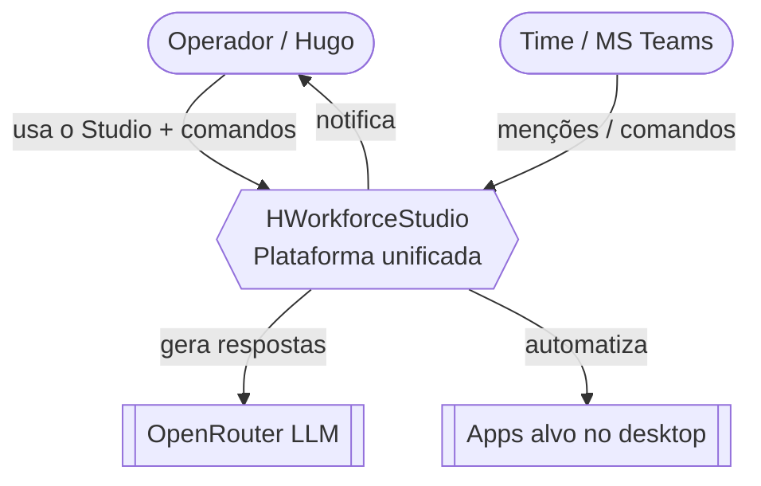
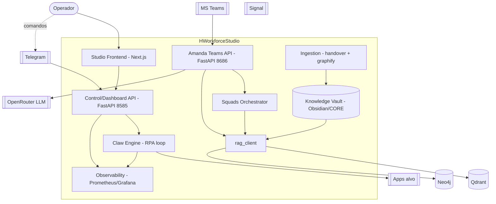
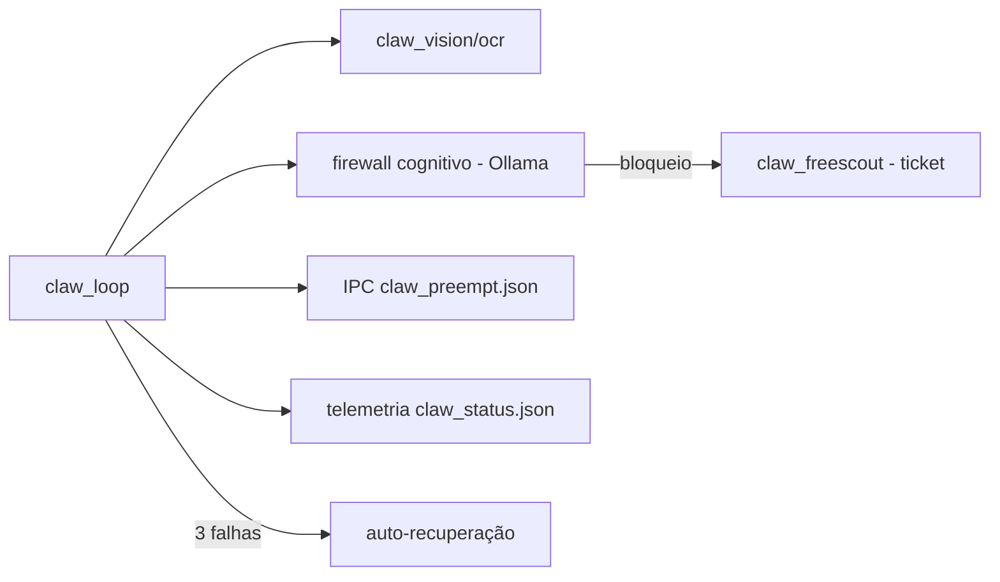
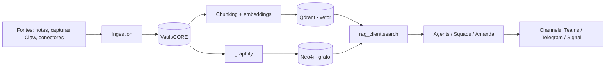
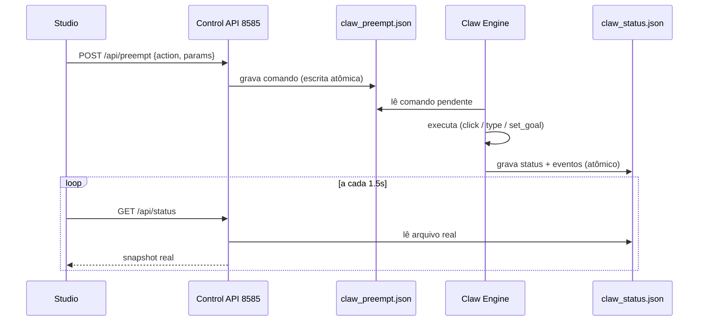
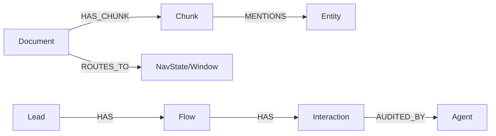
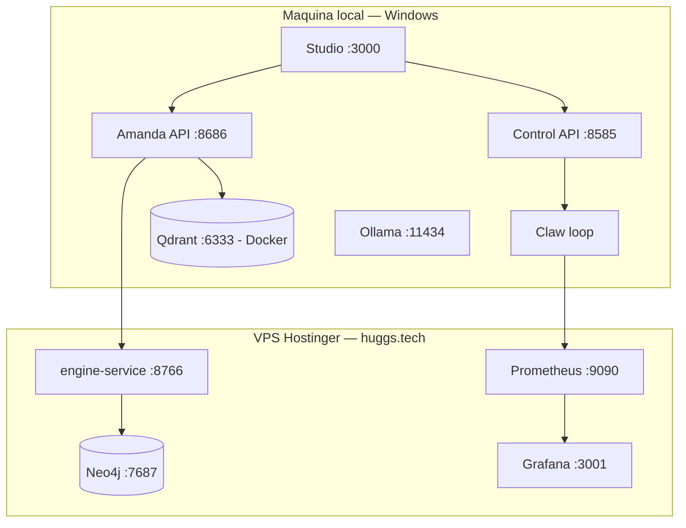

# 🕸️ System Design Inicial — Mecha Huggs Workforce Studio (MECHA ⊕ Omega)

Base: `ALINHAMENTO_MECHA_OMEGA.md`. Este documento desenha a plataforma unificada após o alinhamento dos backends.

## 0. Decisões ratificadas (fundamento)
1. **Busca híbrida = Qdrant (vetorial) + Neo4j (grafo)**; ChromaDB descartado. Acesso por uma interface única `rag_client`.
2. **Conhecimento único:** vault Obsidian/`CORE` é a fonte de verdade; `data/knowledge_base` (ex-`OmegaData/KnowledgeBase`) é derivado/índice.
3. **Governança do MECHA** (emoji rails + Pydantic + validação AST + frontmatter) é transversal a todas as camadas.
4. **Migração incremental** — o MECHA segue em produção enquanto migramos camada a camada.

---

## 1. Visão C4

### 1.1 Contexto (L1)


### 1.2 Containers (L2)


### 1.3 Componentes-chave (L3 — Claw Engine)


---

## 2. Fluxo de dados ponta a ponta

### 2.1 Conhecimento / RAG


### 2.2 Controle do Claw (Studio ↔ backend, dados reais)


---

## 3. Contratos de API por camada

### 3.1 Control/Dashboard API (porta 8585) — consumida pelo Studio
| Método | Rota | Corpo / Resposta |
|---|---|---|
| GET | `/api/health` | → `{product, slug, status, claw_loop}` |
| GET | `/api/status` | → `StatusSnapshot` (conteúdo real de `claw_status.json`) |
| POST | `/api/preempt` | `PreemptCommand` → `{ok:true}` \| 400 `{error}` |
| GET | `/maps/navigation_graph.json` | → grafo de navegação (estático real) |

### 3.2 Amanda Teams API (porta 8686)
| Método | Rota | Observações |
|---|---|---|
| GET | `/health` | status do agente + RAG |
| POST | `/webhook/teams` | HMAC obrigatório (fail-closed); comandos `/task /tribunal /dev /qa` |

### 3.3 Interface `rag_client` (Python)
```python
class Hit(BaseModel):
    text: str
    score: float
    metadata: dict  # file_name, emoji_rail, source, chunk_id, created_at

class RagClient(Protocol):
    def search(self, query: str, limit: int = 3, filters: dict | None = None) -> list[Hit]: ...
    def upsert(self, docs: list["Document"]) -> int: ...
    def graph_query(self, cypher: str, params: dict | None = None) -> list[dict]: ...
```

### 3.4 Modelos Pydantic compartilhados (camada `kernel/contracts`)
```python
class PreemptCommand(BaseModel):
    action: Literal["pause","resume","stop","set_goal","click","type"]
    params: dict = {}

class StatusEvent(BaseModel):
    time: str; level: Literal["info","ok","warn","danger","vision"]; msg: str; id: str

class StatusSnapshot(BaseModel):
    loop_state: Literal["running","paused","offline"] = "offline"
    step: int = 0; max_steps: int = 0
    last_seen_title: str = "N/A"; current_goal: str = ""
    last_thumbnail: str | None = None
    events: list[StatusEvent] = []

class TaskItem(BaseModel):
    id: int; description: str
    status: Literal["pending","completed"]; created_at: str; completed_at: str = ""
```
**Códigos de erro padrão:** 400 (payload inválido), 401 (sem assinatura), 403 (HMAC inválida), 503 (webhook não configurado / fail-closed), 500 (erro interno).

---

## 4. Modelo de dados

### 4.1 Qdrant (vetorial)
- Coleção `knowledge` · `size` = dimensão do modelo de embedding configurado (parametrizável) · `distance` = Cosine.
- Payload/metadata por ponto: `file_name`, `emoji_rail`, `source`, `chunk_id`, `doc_id`, `created_at`, `tags[]`.
- Filtros suportados: por `emoji_rail`, `source`, `tags`.

### 4.2 Neo4j (grafo) — alimentado pelo `graphify`

Nós: `Document, Chunk, Entity, Window(NavState), Lead, Flow, Interaction, Agent`. Arestas: `HAS_CHUNK, MENTIONS, ROUTES_TO, HAS, AUDITED_BY, NEXT`.

### 4.3 Data lake (`data/`)
`inbox/ · parent_store/ · intelligence/ · network_logs/ · errors/ · fakes/ · knowledge_base/(derivado)`.

---

## 5. Stack tecnológica por camada
| Camada | Stack | Justificativa |
|---|---|---|
| kernel | Python 3.11 + Pydantic + AST | contratos/validação já no MECHA |
| execution | Python + asyncio + pyautogui/CV + Ollama | Claw/squads existentes |
| knowledge | Obsidian (vault) + Markdown frontmatter | RAG-first ("Lei 2") |
| index | **Qdrant** + **Neo4j** | vetor performático (já no MECHA) + grafo (visão Omega) |
| data | filesystem estruturado + JSON | local-first, simples |
| ingestion | Python (handover, graphify) | reuso do tooling Omega |
| observability | Prometheus + Grafana | já previsto no Omega |
| interface | Next.js (Studio) + SDK + FastAPI/HTTP | frontend Omega + bots MECHA |
| security | honeypots + firewall cognitivo + .env/secret mgmt | une Omega + MECHA |

---

## 6. Topologia de deploy

**Resiliência:** sem Docker/Qdrant → modo local degradado (RAG opcional); o dashboard continua servindo. Empacotamento PyInstaller usa `sys.executable` + `--hidden-import` para os módulos do `execution`.

---

## 7. Plano de migração incremental
| Fase | Escopo | Pronto quando |
|---|---|---|
| 0 | Congelar baseline + testes de fumaça | suites atuais verdes |
| 1 | `kernel/` (mover contratos/validadores) | AST+Pydantic validam todo o repo |
| 2 | `execution/` (Claw, squads, agents) | bots/Claw rodam da nova árvore |
| 3 | `knowledge/` + `index/` (Qdrant+Neo4j via rag_client) | busca híbrida responde |
| 4 | `data/` + `ingestion/` (popular data lake) | handover→vault→index fim a fim |
| 5 | `observability/` (telemetria→Prom→Grafana) | dashboards com métricas reais |
| 6 | `interface/` (Studio+SDK+channels) | Studio consome backend sem mocks |
| 7 | `security/` (honeypots, segredos, firewall) | fail-closed + segredos fora do git |
Cada fase tem rollback (a árvore antiga permanece até a fase validar).

---

## 8. Observabilidade
- **Métricas:** `claw_loop` (estado, passo/maxsteps, falhas, recuperações), latência de RAG, chamadas/custo OpenRouter (FinOps), latência de comandos preempt. Exporter Prometheus a partir de `observability/telemetry`.
- **Logs:** estruturados por nível (`info/ok/warn/danger/vision`), com tokens mascarados.
- **Eventos:** `claw_status.json` (rolling 30) → `/api/status` → Studio; espelho em Grafana.

---

## 9. Modelo de segurança
- **Segredos:** `.env` + `.gitignore` (já criado); rotação de tokens; nada de credencial em log (scrub aplicado).
- **Canais:** webhook do Teams com HMAC **fail-closed** (503 sem segredo, salvo `MECHA_ALLOW_INSECURE=1`); Telegram com `AUTHORIZED_CHAT_ID`; Studio com auth (a definir: token local/sessão).
- **Defesa:** honeypots/`fakes` (decoys) + firewall cognitivo do Claw (lista determinística + Ollama) antes de qualquer clique/escrita.
- **Dados:** escrita atômica em todos os JSONs lidos pela UI.

---

## 10. Estratégia de testes
| Nível | Alvo |
|---|---|
| Unit | contratos Pydantic, parsers de comando, `_atomic_write_json`, scrub de token |
| Integração | `rag_client` (Qdrant+Neo4j), IPC do Claw (preempt/status), webhook HMAC |
| E2E | Studio ↔ Control API (status/preempt), `/tribunal`→Telegram |
| Smoke (por camada) | health de cada serviço + 1 caminho feliz |
| Verificação | validação AST de hierarquia + lint nos novos módulos |

---

## 11. Riscos e decisões em aberto
| Risco / Decisão | Recomendação |
|---|---|
| Dois stores (Qdrant+Neo4j) aumentam operação | abstrair em `rag_client`; Neo4j opcional na fase 3 |
| Modelo de embedding não padronizado | fixar 1 modelo e versionar a dimensão da coleção |
| Auth do Studio ainda indefinida | token local + CORS restrito em produção (hoje `*`) |
| Workspace em OneDrive (leituras parciais) | rodar a stack fora do OneDrive ou pausar sync |
| Engine OmegaHuggs (ChromaDB/Neo4j) vs MECHA (Qdrant) | migrar engine para `rag_client` comum |

---

## 12. Governança
- Todo módulo novo carrega frontmatter com `emoji_rail` e passa pelo validador AST (`dynamic_typing.py`).
- Contratos em `kernel/contracts` (Pydantic) — entradas/saídas tipadas (coords do Claw, payloads, hits de RAG).
- **Ownership sugerido:** Amanda → `interface`/`execution`; Vanessa → `index`/`data`/`ingestion`; compartilhado → `kernel`/`security`.

---

## Decisões e próximos passos
1. Ratificar embedding model + dimensão da coleção Qdrant.
2. Definir auth do Studio e restringir CORS em produção.
3. Implementar `rag_client` (Qdrant + Neo4j) como primeira peça da fase 3.
4. Iniciar a migração pela **Fase 1 (kernel)** mantendo o MECHA em produção.

*Fim do System Design inicial.*
