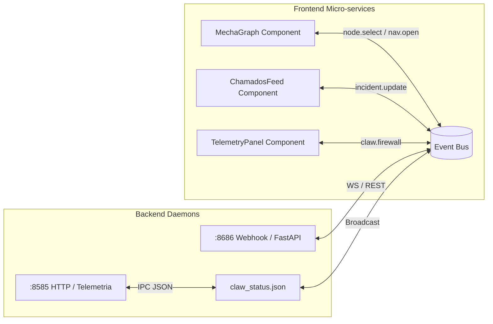

# 🌌 MECHA Event Bus Specification

> **"Barramento unificado de eventos assíncronos para micro-frontends e daemons de infraestrutura."**

Este documento especifica o contrato de comunicação bidirecional do **Event Bus** do MECHA, detalhando o tráfego de dados ponto a ponto (peer-to-peer) entre micro-frontends e a ponte com os daemons Python no backend (Antigravity).

---

## 1. Topologia de Integração

Os micro-frontends (como `MechaGraph`, `ChamadosFeed` e `TelemetryPanel`) comunicam-se de forma descentralizada por meio do `EventBus`. A arquitetura foi expandida para que os submódulos assinem o barramento diretamente via WebSockets ou polling unificado, reduzindo a dependência de callbacks globais no Shell do frontend.



---

## 2. Estrutura do Envelope de Mensagem

Todas as mensagens trafegadas no barramento devem seguir o seguinte envelope padronizado para garantir validação de tipo e consistência estrutural:

```json
{
  "topic": "nome.do.topico",
  "sender": "identificador_remetente",
  "timestamp": 1718983200000,
  "payload": {}
}
```

### Propriedades do Envelope:
* `topic` (String): O canal do evento utilizando notação de pontos (ex: `node.select`).
* `sender` (String): O componente de origem (ex: `MechaGraph`, `ClawFirewall`).
* `timestamp` (Integer): Epoch timestamp em milissegundos.
* `payload` (Object): Parâmetros estruturados específicos para cada tópico.

---

## 3. Catálogo de Tópicos e Payloads

### A. Seleção de Nós (`node.select`)
Disparado quando um nó da árvore de navegação é selecionado ou focado no Grafo.
```json
{
  "topic": "node.select",
  "sender": "MechaGraph",
  "timestamp": 1718983210000,
  "payload": {
    "node_id": "login_view",
    "title": "Opera - Smartico Login",
    "controls_count": 2
  }
}
```

### B. Transição de Visualização (`nav.open`)
Notifica a abertura de uma nova interface ou aba de navegação.
```json
{
  "topic": "nav.open",
  "sender": "NavigationRail",
  "timestamp": 1718983215000,
  "payload": {
    "view_id": "dashboard_admin",
    "route": "/ops/dashboard",
    "source": "manual_click"
  }
}
```

### C. Alertas de Firewall (`claw.firewall`)
Emitido pelo daemon do Firewall do Claw quando uma ação é interceptada por segurança, ou quando o operador manual autoriza/bloqueia a transição.
```json
{
  "topic": "claw.firewall",
  "sender": "ClawFirewallDaemon",
  "timestamp": 1718983220000,
  "payload": {
    "action_id": "click_excluir_user",
    "risk": "dangerous",
    "reason": "Uso de termo proibido 'excluir'",
    "context": "Botão de Excluir Usuário no painel admin",
    "status": "blocked" 
  }
}
```
* Valores permitidos em `status`: `"blocked"`, `"allowed"`, `"confirmed"`.

### D. Chamados e Incidentes (`incident.update`)
Utilizado para sincronização bidirecional com o FreeScout.
```json
{
  "topic": "incident.update",
  "sender": "ClawFreeScoutIntegration",
  "timestamp": 1718983225000,
  "payload": {
    "ticket_number": 104,
    "url": "http://localhost:8080/conversation/104",
    "kind": "firewall_block",
    "status": "open"
  }
}
```

---

## 4. Protocolo e Conectividade do Back-end

O backend implementa o suporte ao barramento de duas formas para suportar ambientes degradados:

### 1. Conexão WebSockets (`/ws/bus`)
* **Endpoint**: `ws://localhost:8585/ws/bus` (integrado na classe HTTP/WS do backend).
* **Handshake**: No momento da conexão, o cliente pode enviar uma lista de tópicos de interesse:
  ```json
  { "action": "subscribe", "topics": ["node.select", "claw.firewall"] }
  ```
* **Garantia de Entrega**: Caso o WebSocket desconecte, o cliente deve re-tentar a conexão a cada 3000ms usando backoff exponencial e realizar o re-registro das inscrições.

### 2. Fallback REST API (`/api/bus`)
Em redes ou navegadores sem suporte a WebSocket, o cliente realiza polling a cada 1500ms no endpoint:
* **HTTP POST `/api/bus/publish`**: Publica um novo evento.
* **HTTP GET `/api/bus/poll?since=<timestamp>`**: Recupera eventos enfileirados no barramento desde o timestamp solicitado.

---

## 5. Estratégia de Ciclo de Vida nos Micro-frontends (React)

Para garantir que os micro-frontends assinem de forma robusta sem vazamento de memória:

1. **Inscrição no `componentDidMount`**:
   ```javascript
   componentDidMount() {
       this.unsubscribeBus = this.props.vm.bus.subscribe([
           "node.select",
           "nav.open",
           "claw.firewall"
       ], this.handleBusEvents);
   }
   ```
2. **Re-tentativa no `componentDidUpdate`**:
   Se a referência do barramento mudar ou reiniciar, o componente cancela a inscrição antiga e se registra no novo canal.
3. **Limpeza no `componentWillUnmount`**:
   Invocar `this.unsubscribeBus()` para evitar múltiplas chamadas ativas nos componentes destruídos.
