# 🕸️ MECHA Multi-Agent Orchestrator Ontology

Esta documentação foi gerada autonomamente pelo Orquestrador para validar a integridade da topologia do MECHA e testar a ingestão no MCP/Qdrant.

## Topologia de Domínios

```mermaid
graph TD
    Root["C:\Users\huggs\OneDrive\Documentos\workspace\.mecha"]

    %% Domínios Core
    Root --> ops["ops (Domínio de Fluxos)"]
    Root --> squads["squads (Core Domain)"]
    Root --> ragDojo["rag-dojo (RAG Spiral Training)"]
    Root --> kernel["kernel (Core Domain)"]
    Root --> behavior["behavior (Core Domain)"]
    Root --> intelligence["intelligence (Core Domain)"]
    Root --> foundation["foundation (Core Domain)"]
    Root --> governance["governance (Core Domain)"]
    Root --> testDb["test_db (Core Domain)"]
    Root --> docs["docs (Core Domain)"]
    Root --> core["CORE (Core Domain)"]

    %% Componentes de ops
    ops --> ops_bootstrap["bootstrap.js"]
    ops --> ops_telegram["enviar_relatorio_telegram.py"]
    ops --> ops_generate["generate_ontology.py"]
    ops --> ops_mecha["mecha_app.py"]

    %% Componentes de rag-dojo
    ragDojo --> rag_claude["CLAUDE.md"]
    ragDojo --> rag_cli["cli.py"]
    ragDojo --> rag_contracts["contracts.py"]
    ragDojo --> rag_guia["guia_patterns_funcionais_v2.md"]
    ragDojo --> rag_pipeline["pipeline_factory.py"]
    ragDojo --> rag_readme["README.md"]
    ragDojo --> rag_replication["replication_checklist_bulletproof_v2.md"]

    %% Componentes de docs
    docs --> docs_bridge["ANTIGRAVITY_BRIDGE_PROMPT.md"]
    docs --> docs_bus["EVENT_BUS.md"]

    %% Componentes de CORE (amostra)
    core --> core_aios["AI-OS-META-SEGMENTED.md"]
    core --> core_memory["MEMORY.md"]
    core --> core_arch["arquitetura-projeto.md"]
    
    style Root fill:#1f2937,stroke:#3b82f6,stroke-width:4px,color:#fff
    style ops fill:#374151,stroke:#10b981,color:#fff
    style ragDojo fill:#374151,stroke:#8b5cf6,color:#fff
```

## Resumo Estrutural
- **Versão da Ontologia:** 1.0.0
- **Total de Domínios Mapeados:** 11 (`ops`, `squads`, `rag-dojo`, `kernel`, `behavior`, `intelligence`, `foundation`, `governance`, `test_db`, `docs`, `CORE`)
- **Status:** Ativo e Mapeado para orquestração.
